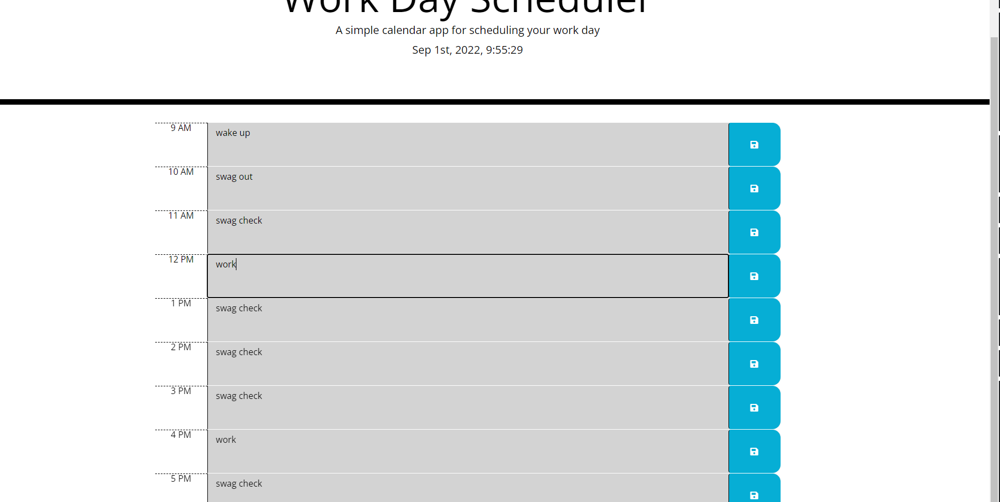

# GAMER QUIZ
 Quiz for Gamers
Daniel Amadril JavaScript API Project

## API QUIZ
Creating a quiz with multiple choice questions, a timer and much more.

## Description
This project is simply for acedemic purposes. Creating a shcedule planner for for the average 9am-5pm time frame. I implemented moment.js to connect real time to my blocks of code Understanding what bootstrap and Jquery can acomplish was really my goal. I spent a lot of time trying to confiugure local Storage, momentJS functions and etc! 
Demo:

Credit
Original Version: Daniel Amadril (wickedslug883)

Current Version: https://github.com/wickedslug883

License
MIT License

##  Copyright (c) [2022] [DanielAmadril]

Permission is hereby granted, free of charge, to any person obtaining a copy of this software and associated documentation files (the "Software"), to deal in the Software without restriction, including without limitation the rights to use, copy, modify, merge, publish, distribute, sublicense, and/or sell copies of the Software, and to permit persons to whom the Software is furnished to do so, subject to the following conditions:

The above copyright notice and this permission notice shall be included in all copies or substantial portions of the Software.

THE SOFTWARE IS PROVIDED "AS IS", WITHOUT WARRANTY OF ANY KIND, EXPRESS OR IMPLIED, INCLUDING BUT NOT LIMITED TO THE WARRANTIES OF MERCHANTABILITY, FITNESS FOR A PARTICULAR PURPOSE AND NONINFRINGEMENT. IN NO EVENT SHALL THE AUTHORS OR COPYRIGHT HOLDERS BE LIABLE FOR ANY CLAIM, DAMAGES OR OTHER LIABILITY, WHETHER IN AN ACTION OF CONTRACT, TORT OR OTHERWISE, ARISING FROM, OUT OF OR IN CONNECTION WITH THE SOFTWARE OR THE USE OR OTHER DEALINGS IN THE SOFTWARE.JAVASCRIPT PRACTICE
